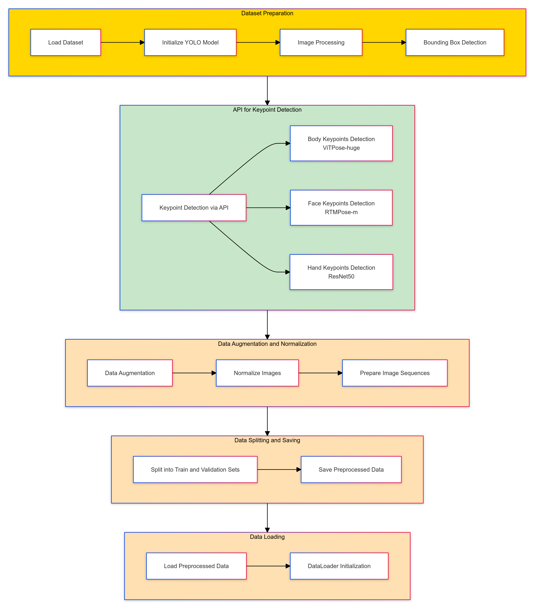
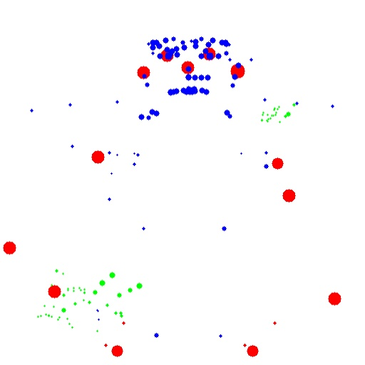
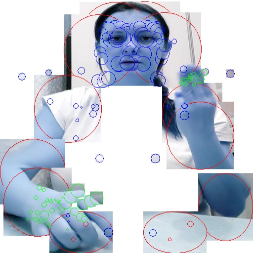
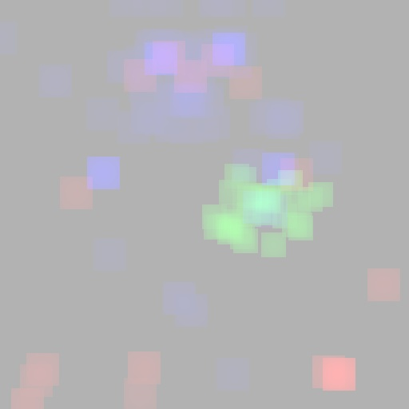
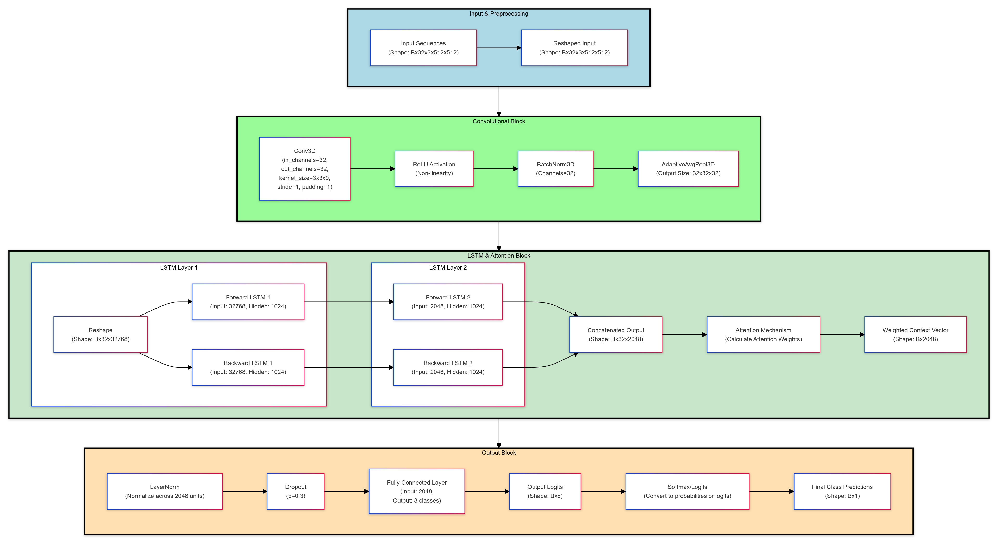

# Распознавание русского жестового языка

## Описание проекта

Этот проект посвящен разработке системы распознавания русского жестового языка (РЖЯ) с использованием методов компьютерного зрения и глубокого обучения.  

## Цели проекта

Разработка системы распознавания РЖЯ.

## Пайплайн подготовки данных

1. **Загрузка датасета:** Загрузка видеозаписей жестов из датасета SLOVO.
2. **Детекция ограничивающих рамки:** Использование модели YOLO для обнаружения людей на кадрах и детекции рук.
3. **Детекция ключевых точек:** Применение MMPose (ViTPose-huge, ResNet50, RTMPose-m) для определения ключевых точек тела, лица и рук.
4. **Создание многоканального представления:**
    - Визуализация только ключевых точек на белом фоне.
    - Оригинальное изображение только в зоне ключевых точек с размером окружностей, соответствующим уверенности модели.
    - Визуализация движения между кадрами с помощью цветовых карт интенсивности.
6. **Нормализация изображений:** Нормализация значений пикселей для улучшения обучения модели.
7. **Подготовка последовательностей изображений:** Формирование последовательностей кадров фиксированной длины (16 кадров).
9. **Сохранение предобработанных данных:** Сохранение предобработанных данных в формате HDF5 для ускорения последующей загрузки.

| Визуализация ключевых точек | Оригинальное изображение с уверенностью | Визуализация движения |
|---|---|---|
|  |  |  |

## Модель

Модель представляет собой комбинацию 3D CNN, двунаправленной LSTM с механизмом внимания:

- **3D CNN:** Извлекает пространственно-временные признаки из последовательности кадров.
- **Двунаправленная LSTM:**  Обрабатывает временные зависимости в последовательности признаков.
- **Механизм внимания:**  Позволяет модели фокусироваться на наиболее важных частях последовательности для принятия решения.